================================================================================
Orientation detection results and evaluation
================================================================================

Quantitative results
---------------------
All wildlife cases are trained with the same model and using the same training setup.

The results vary from case to case.
Good results are achieved on sea dragon heads, whale sharks, sea turtle heads, spotted dolphins
and right whales where ground truth annotations are consistent.

Detecting orientation on manta rays is challenging due to variety of
viewpoints and poses of mantas underwater.
More training data will improve the accuracy.

Results on hammerhead sharks are low due to noisy ground truth annotations where
some images are annotated with the head as the front and other images are
annotated with the tail as the front.
These discrepancies affect the learning process and the model usually chooses a point
in the middle of the body during optimization.
Cleaning annotations will improve performance
dramatically as hammerhead sharks have a very distinct shape of the head.

Accuracy
==========

Accuracy of predicting an angle of orientation on **a test set** at **10, 15 and 20 degrees thresholds**:

+----------------------+---------------+--------------+--------------+
| Dataset              | Thr 10 deg    | Thr 15 deg   | Thr 20  deg  |
+======================+===============+==============+==============+
| Sea Dragon heads     | 95.20%        | 97.73%       |  98.11%      |
+----------------------+---------------+--------------+--------------+
| Whale Shark          | 87.91%        | 93.28%       |  94.63%      |
+----------------------+---------------+--------------+--------------+
| Sea Turtle heads     | 84.64%        | 91.64%       |  94.71%      |
+----------------------+---------------+--------------+--------------+
| Spotted Dolphin      | 81.04%        | 88.08%       |  91.83%      |
+----------------------+---------------+--------------+--------------+
| Right Whale          | 81.34%        | 83.92%       |  84.78%      |
+----------------------+---------------+--------------+--------------+
| Manta Ray            | 67.55%        | 74.96%       |  79.28%      |
+----------------------+---------------+--------------+--------------+
| Hammerhead Shark     | 52.19%        | 61.56%       |  66.14%      |
+----------------------+---------------+--------------+--------------+

Histograms
===========
Histogram of errors in detection of angle *theta* on the test set.

Sea Dragon heads:

.. figure:: ../examples/seadragon_hist_test2020.png
   :align: center

Whale Shark:

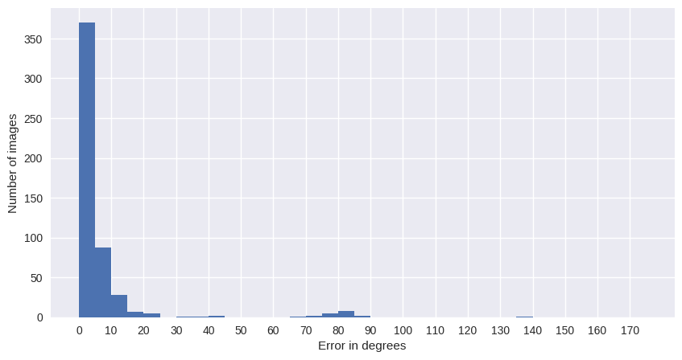

Sea Turtle heads:

.. figure:: ../examples/seaturtle_hist_test2020.png
   :align: center

Spotted Dolphin:

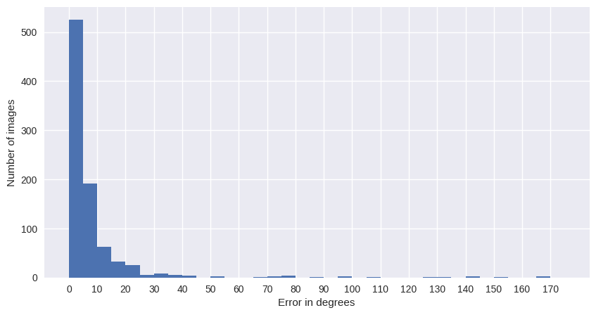

Right Whale:

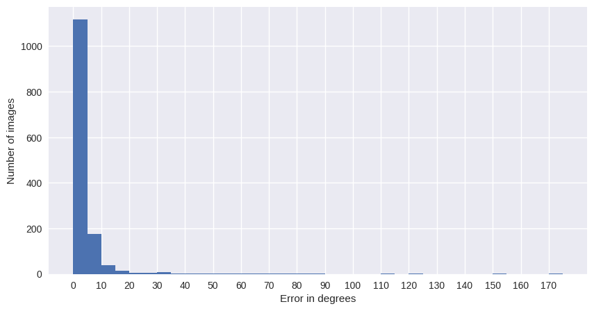

Manta Ray:

.. figure:: ../examples/mantaray_hist_test2020.png
   :align: center

Hammerhead Shark:

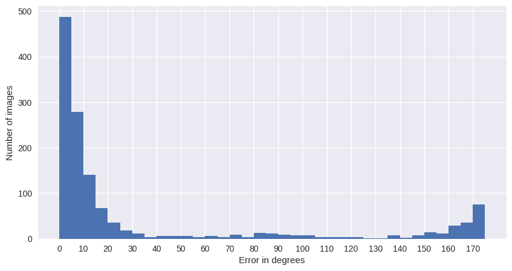

Qualitative results
--------------------

Sea Dragon heads
================

Green is an axis-aligned box, Red is a detected object-aligned box. Yellow side indicates a detected front of the animal.

Original orientation vs Detected orientation:

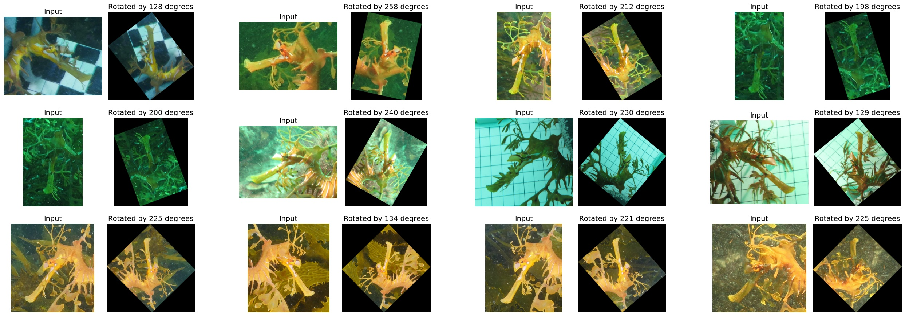

Whale Shark
================

Green is an axis-aligned box, Red is a detected object-aligned box. Yellow side indicates a detected front of the animal.

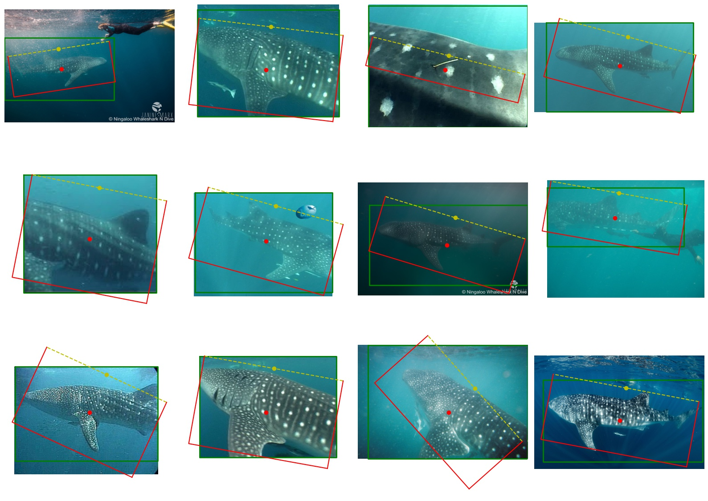

Original orientation vs Detected orientation:

.. figure:: ../examples/whaleshark_rotated_1.jpg
   :align: center

Sea turtle heads
=================

Green is an axis-aligned box, Red is a detected object-aligned box. Yellow side indicates a detected front of the animal.

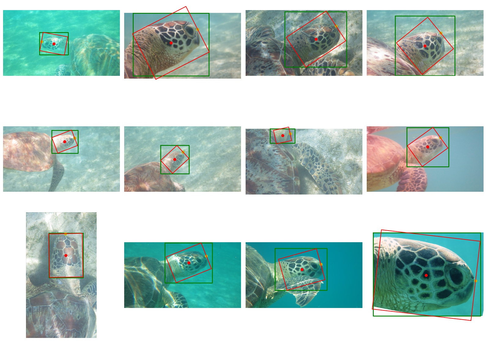

Original orientation vs Detected orientation:

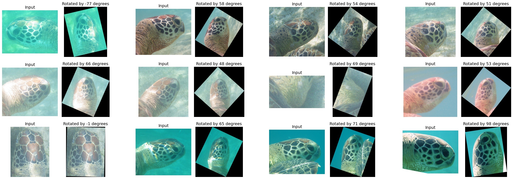

Spotted Dolphin
================

Green is an axis-aligned box, Red is a detected object-aligned box. Yellow side indicates a detected front of the animal.

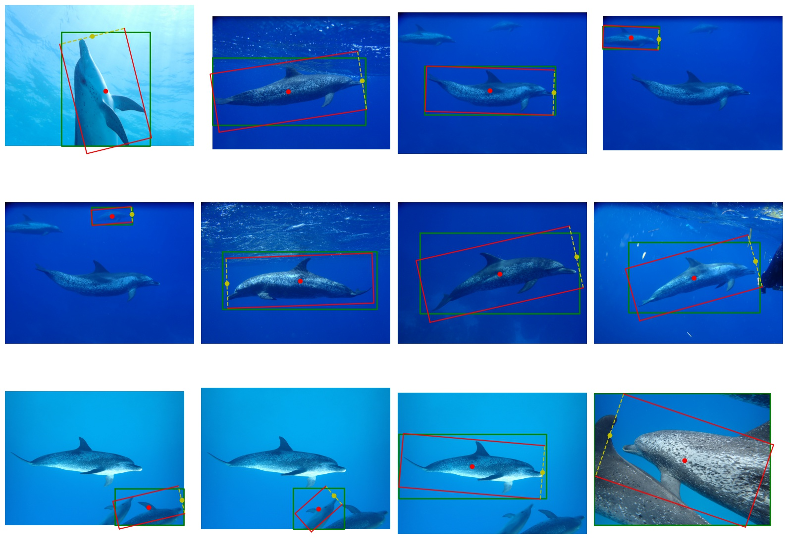

Original orientation vs Detected orientation:

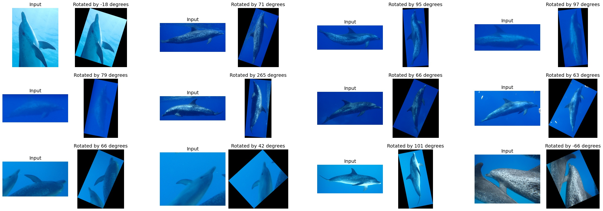

Right Whale
================

Green is an axis-aligned box, Red is a detected object-aligned box. Yellow side indicates a detected front of the animal.

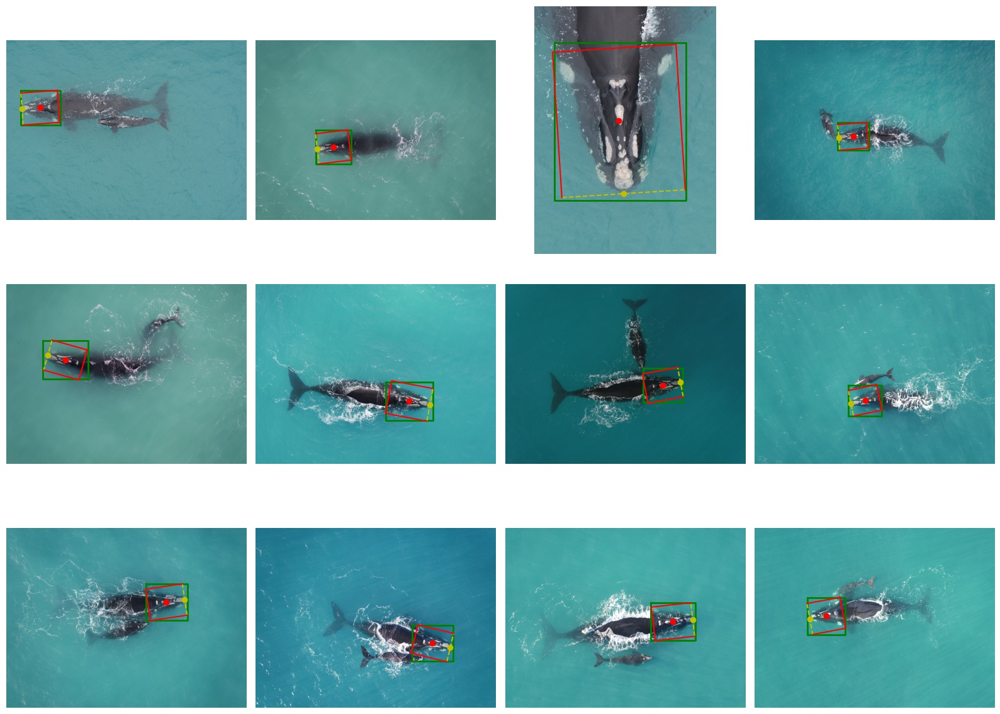

Original orientation vs Detected orientation:

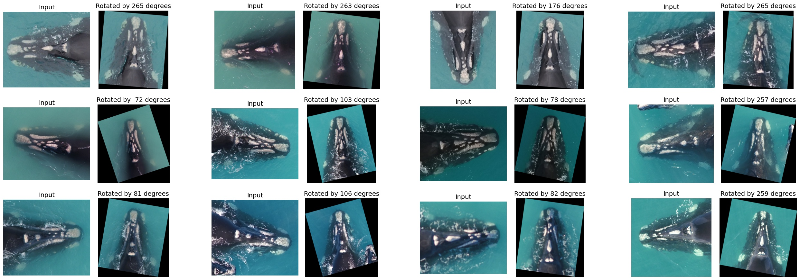

Manta Ray
==============

Green is an axis-aligned box, Red is a detected object-aligned box. Yellow side indicates a detected front of the animal.

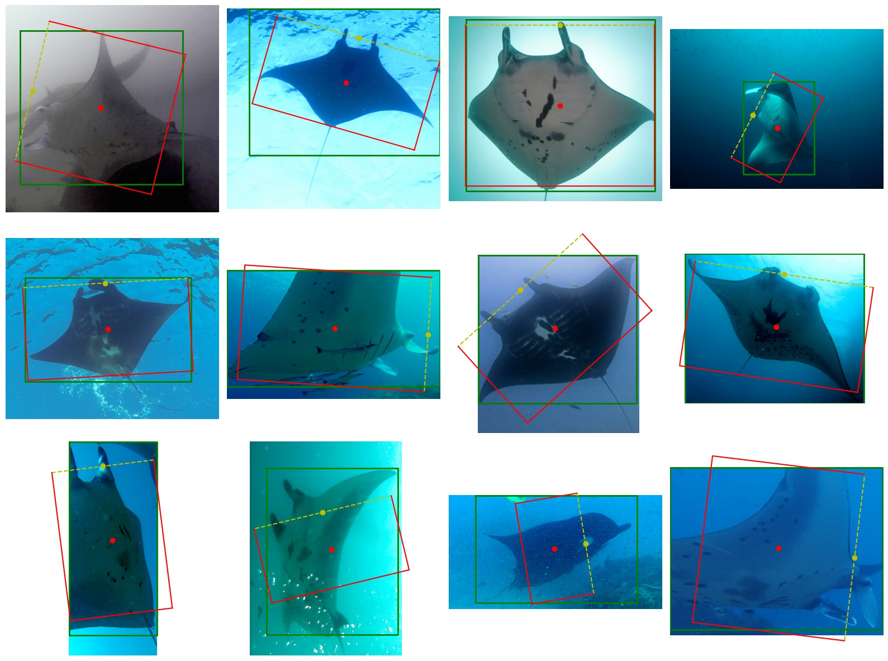

Original orientation vs Detected orientation:

Hammerhead Shark
================

Green is an axis-aligned box, Red is a detected object-aligned box. Yellow side indicates a detected front of the animal.

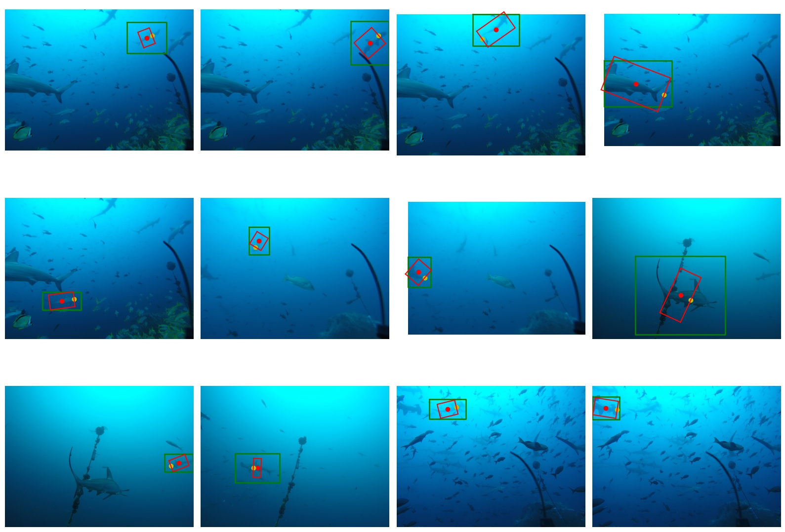

Original orientation vs Detected orientation:

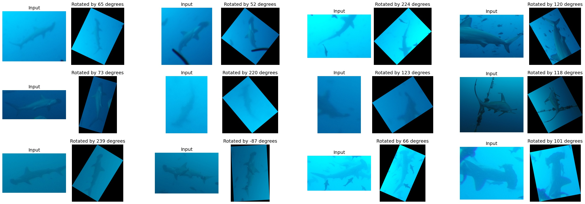
