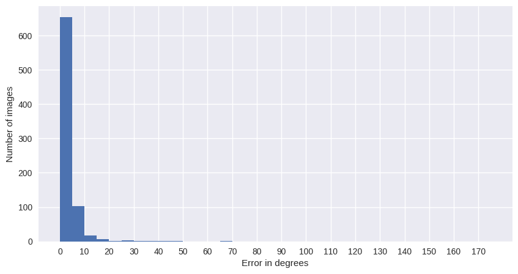
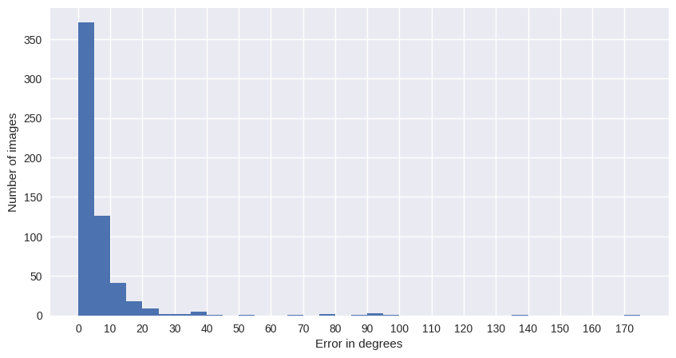
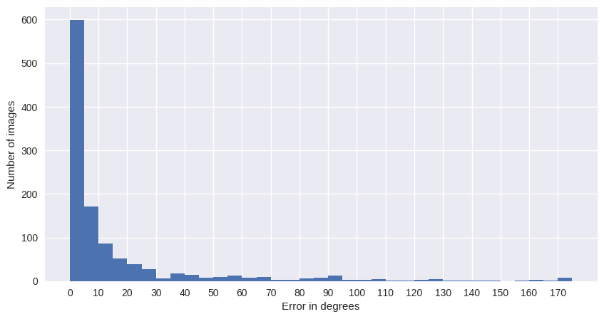
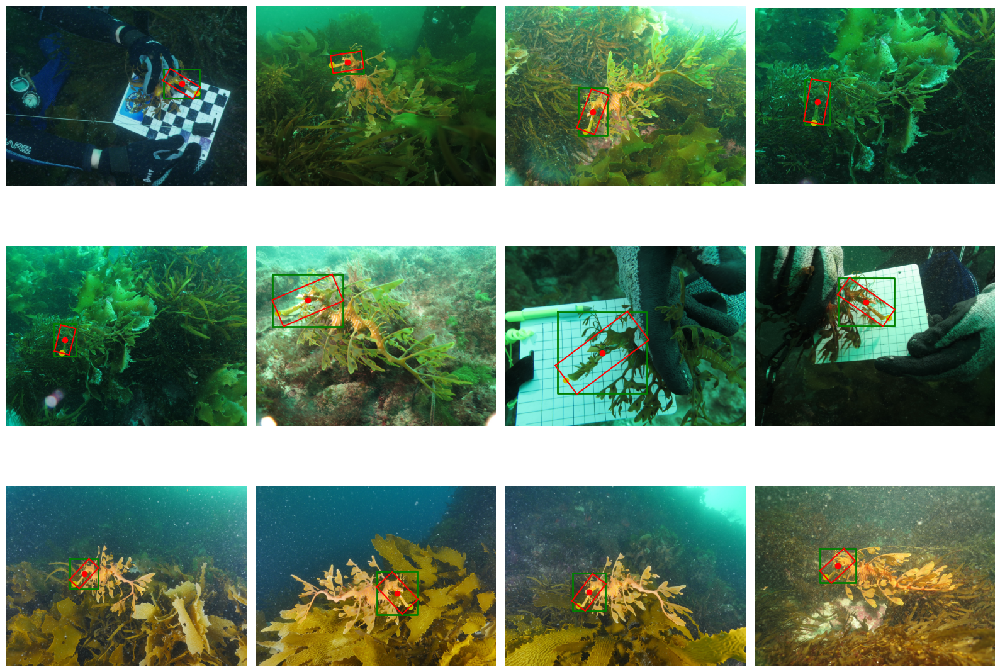
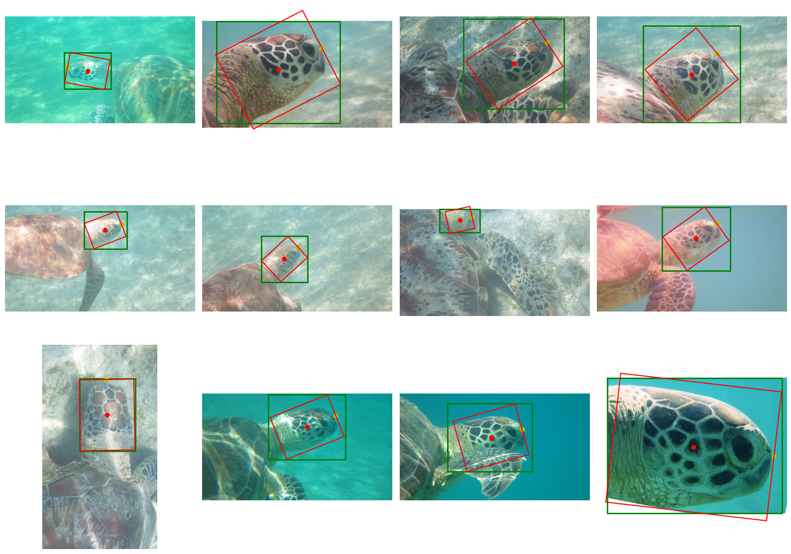
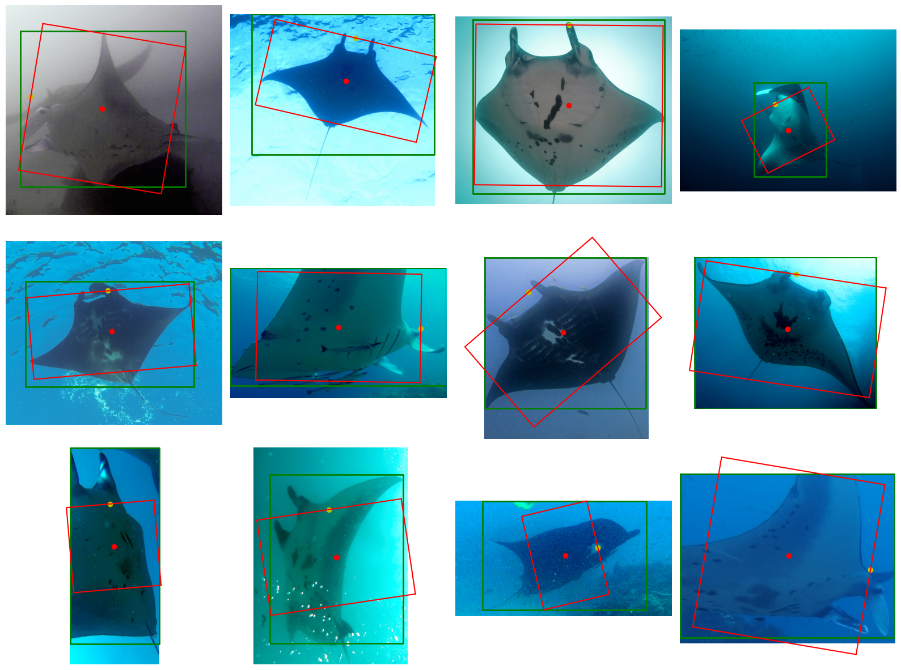
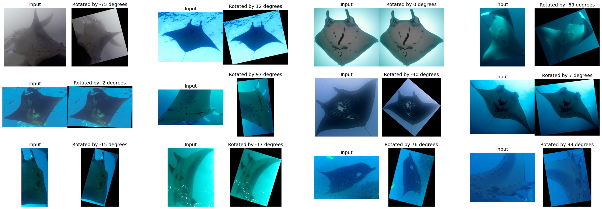

================================================================================
Orientation detection results and evaluation
================================================================================

Quantitative results
---------------------

Accuracy
==========

Accuracy of predicting an angle of orientation on **a test set**.

Accuracy is computed for **10 and 15 degrees thresholds**:

+----------------------+---------------+--------------+
| Dataset              | Thr 10 deg    | Thr 15 deg   |
+======================+===============+==============+
| Sea Dragon heads     | 95.20%        | 97.73%       |
+----------------------+---------------+--------------+
| Sea Turtle heads     | 84.64%        | 91.64%       |
+----------------------+---------------+--------------+
| Spotted Dolphin      | 81.04%        | 88.08%       |
+----------------------+---------------+--------------+
| Manta Ray            | 67.55%        | 74.96%       |
+----------------------+---------------+--------------+
| Right Whale          | 81.34%        | 83.92%       |
+----------------------+---------------+--------------+
| Hammerhead Shark     | 52.19%        | 61.56%       |
+----------------------+---------------+--------------+
| Whale Shark          | 87.91%        | 93.28%       |
+----------------------+---------------+--------------+

Histograms
===========
Histogram of errors in detection of angle *theta* on the test set.

Sea Dragon heads:

Sea Turtle heads:

Manta Rays:

Qualitative results
--------------------

Sea Dragon heads
================

Green - axis-aligned box, Red - detected object-aligned box. Yellow dot indicates the front of the animal.

Original orientation vs Detected orientation:

.. figure:: ../examples/seadragon_rotated_1.png
   :align: center

Sea turtle heads
=================

Green - axis-aligned box, Red - detected object-aligned box. Yellow dot indicates the front of the animal.

Original orientation vs Detected orientation:

.. figure:: ../examples/seaturtle_rotated_1.png
   :align: center

Manta rays
==============

Green - axis-aligned box, Red - detected object-aligned box. Yellow dot indicates the front of the animal.

Original orientation vs Detected orientation:

