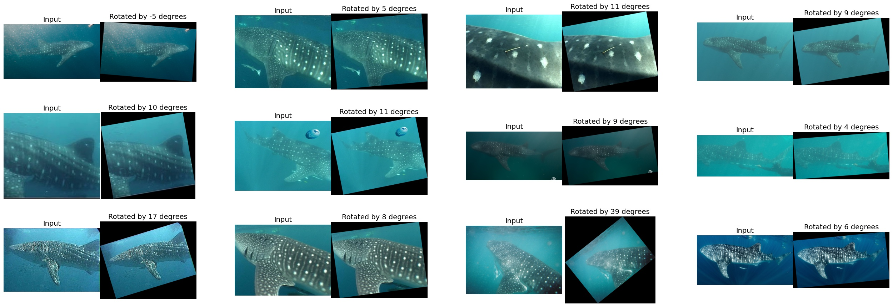
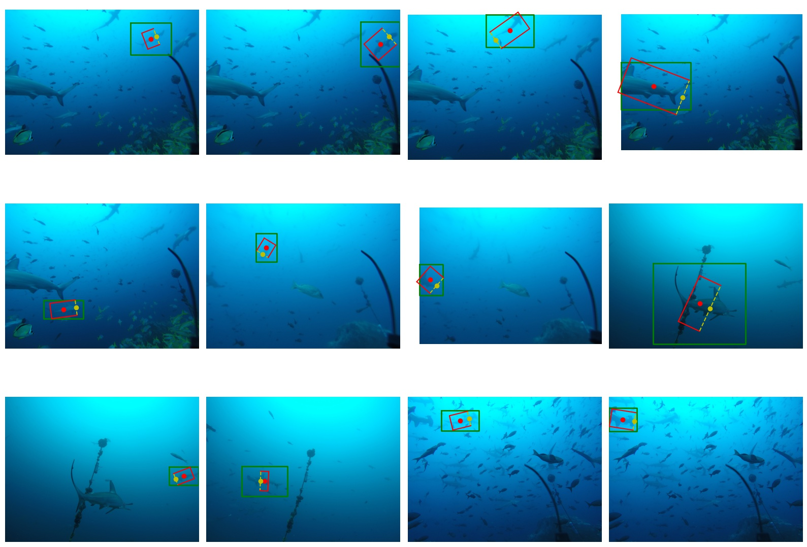

================================================================================
Orientation detection results and evaluation
================================================================================

Quantitative results
---------------------
All wildlife cases are trained with the same model and the same training setup.

Accuracy
==========

Accuracy of predicting an angle of orientation on **a test set** at **10, 15 and 20 degrees thresholds**:

+----------------------+---------------+--------------+--------------+
| Dataset              | Thr 10 deg    | Thr 15 deg   | Thr 20  deg  |
+======================+===============+==============+==============+
| Sea Dragon heads     | 95.20%        | 97.73%       |  98.11%      |
+----------------------+---------------+--------------+--------------+
| Whale Shark          | 87.91%        | 93.28%       |  94.63%      |
+----------------------+---------------+--------------+--------------+
| Sea Turtle heads     | 84.64%        | 91.64%       |  94.71%      |
+----------------------+---------------+--------------+--------------+
| Spotted Dolphin      | 81.04%        | 88.08%       |  91.83%      |
+----------------------+---------------+--------------+--------------+
| Right Whale          | 81.34%        | 83.92%       |  84.78%      |
+----------------------+---------------+--------------+--------------+
| Manta Ray            | 67.55%        | 74.96%       |  79.28%      |
+----------------------+---------------+--------------+--------------+
| Hammerhead Shark     | 52.19%        | 61.56%       |  66.14%      |
+----------------------+---------------+--------------+--------------+

Histograms
===========
Histogram of errors in detection of angle *theta* on the test set.

Sea Dragon heads:

.. figure:: ../examples/seadragon_hist_test2020.png
   :align: center

Whale Shark:

Sea Turtle heads:

Spotted Dolphin:

Right Whale:

Manta Ray:

Hammerhead Shark:

Qualitative results
--------------------

Sea Dragon heads
================

Green - an axis-aligned box, Red - a detected object-aligned box. Yellow dot indicates a detected front of the animal.

.. figure:: ../examples/seadragon_bboxes_1.jpg
   :align: center

Original orientation vs Detected orientation:

Whale Shark
================

Green - an axis-aligned box, Red - a detected object-aligned box. Yellow dot indicates a detected front of the animal.

Original orientation vs Detected orientation:

Sea turtle heads
=================

Green - an axis-aligned box, Red - a detected object-aligned box. Yellow dot indicates a detected front of the animal.

Original orientation vs Detected orientation:

Spotted Dolphin
================

Green - an axis-aligned box, Red - a detected object-aligned box. Yellow dot indicates a detected front of the animal.

Original orientation vs Detected orientation:

Right Whale
================

Green - an axis-aligned box, Red - a detected object-aligned box. Yellow dot indicates a detected front of the animal.

Original orientation vs Detected orientation:

Manta Ray
==============

Green - an axis-aligned box, Red - a detected object-aligned box. Yellow dot indicates a detected front of the animal.

Original orientation vs Detected orientation:

Hammerhead Shark
================

Green - an axis-aligned box, Red - a detected object-aligned box. Yellow dot indicates a detected front of the animal.

Original orientation vs Detected orientation:

